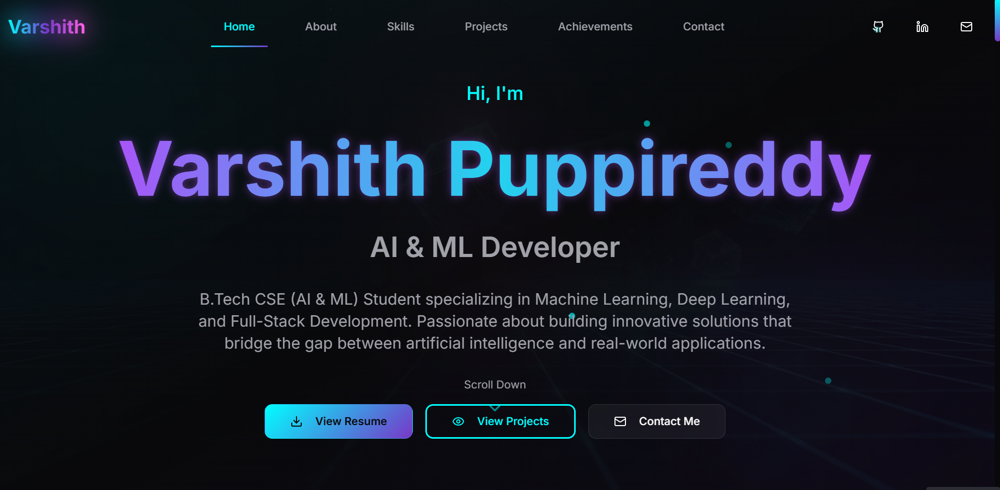
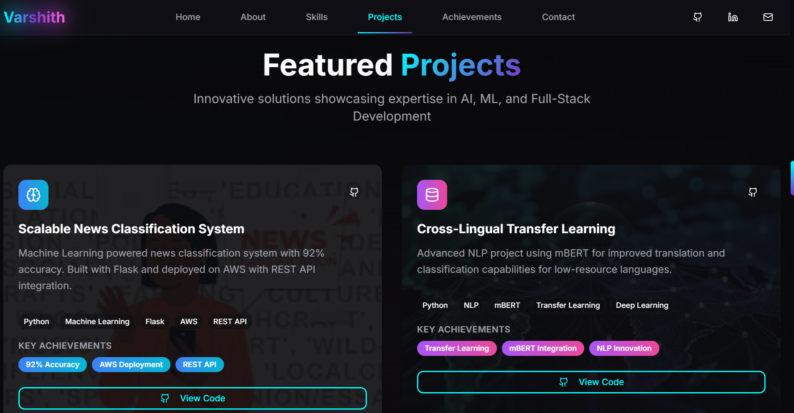

# 🚀 Varshith Puppireddy – Futuristic Portfolio


Hey there 👋  
Welcome to my **cyberpunk-inspired portfolio** — a space where I share the projects, skills, and ideas I’m most excited about.  
I built it because I wanted something more than a plain portfolio: something *alive*, animated, and fun to explore.

---

## ✨ What’s Inside

- A **sleek, futuristic UI** (glass-morphism + neon vibes)
- Fully **responsive design** that works on every screen size
- **3D elements** powered by [Three.js](https://threejs.org/)
- **Smooth animations** thanks to [Framer Motion](https://www.framer.com/motion/)
- **Dark mode** because everything looks cooler at night 🌙
- A **contact form** so you can message me directly
- Dedicated sections for **Projects, Skills, Achievements, Education**, and more

---

## 🛠️ Tech I Used

- **Frontend:** React + TypeScript + Vite  
- **Styling:** TailwindCSS, Radix UI, shadcn/ui, plus a bit of custom CSS  
- **3D & Animations:** Three.js, Framer Motion  
- **Tools:** Bun, ESLint, Prettier  
- **Email service:** EmailJS

---

## 🚀 Get Started (Run Locally)

If you’d like to explore or tweak this portfolio yourself:

1. **Clone the repo**
   ```bash
   git clone https://github.com/MrVarshu/Varshith-portfolio.git
   cd Varshith-portfolio
   ```

2. **Install dependencies**
   ```bash
   bun install
   # or
   npm install
   ```

3. **Start the dev server**
   ```bash
   bun run dev
   # or
   npm run dev
   ```

4. Open your browser at `http://localhost:5173` 🎉

---

## 🖼️ A Peek Inside

### 🏠 Home


### 💻 Projects


### 🛠 Skills


---

## 🌐 Live Demo

👉 [Check out the live site](https://www.varshithpuppireddy.me)

---

## 📬 Let’s Connect

Have feedback, questions, or just want to say hi?  
Drop a message through the site’s contact form or email me at [puppireddyvarshith@gmail.com](mailto:puppireddyvarshith@gmail.com).

---

## 📄 License

MIT License — you’re free to fork, remix, or build on top of this project.

---

> Crafted with ❤️ by **Varshith Puppireddy**  
> _Inspired by cyberpunk vibes & modern web technologies._
